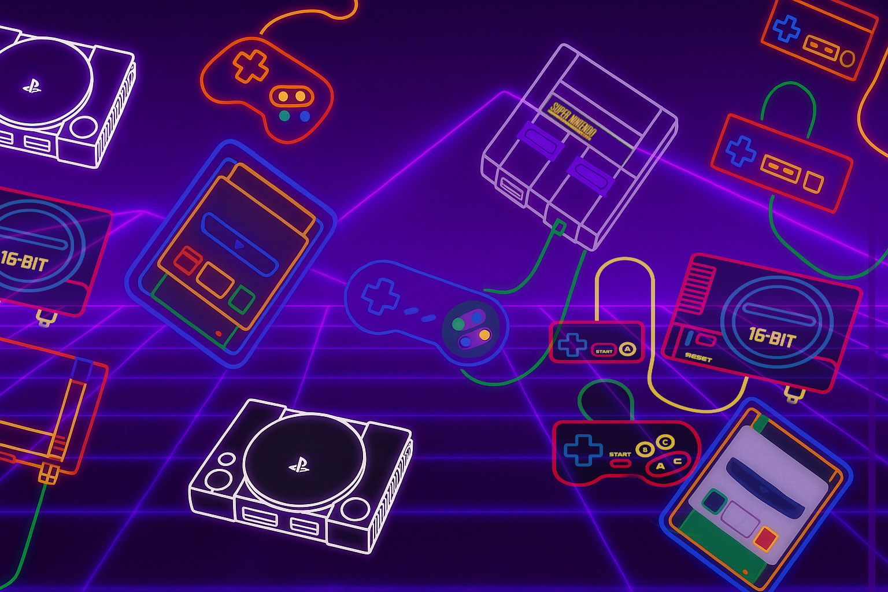

# Mini

<p align="center">
  
</p>

Tema para RetroPie inspirado en consolas "mini" (NES, SNES J, SNES U y PSX).

## 🎮 Tema Mini para EmulationStation-X (RetroPie)

Tema visual liviano y minimalista para EmulationStation, ideal para pantallas pequeñas o configuraciones portátiles.

> ✅ Disponible desde **ThemeBrowser** en **EmulationStation-X**.

---

## 📦 Características

- Diseño compacto y eficiente.
- Ideal para pantallas pequeñas (320x240, 480x270 y 640x480).
- Soporte para múltiples sistemas.
- Script de personalización incluido para `retropiemenu`.

---

## 📥 Instalación

1. Cloná este repositorio:

```bash
git clone https://github.com/Renetrox/Mini.git
```

2. Copiá la carpeta del tema a:

```bash
~/.emulationstation/themes/
```

3. (Opcional) Copiá el script `Customize mini.sh` al menú de RetroPie:

```bash
cp "layout/Customize mini.sh" ~/RetroPie/retropiemenu/
```

4. Ejecutá el script desde el menú RetroPie o manualmente:

```bash
bash ~/RetroPie/retropiemenu/Customize\ mini.sh
```

---

## 🧪 Compatibilidad

- RetroPie 4.8 o superior.
- Raspberry Pi 3 / 4 / Zero.
- Orange Pi y SBC compatibles.
- Pantallas pequeñas: 320×240, 480×270, 640×480.

---

## 📄 Licencia

Este proyecto está bajo la licencia MIT.

---

## 🙌 Créditos

- **Autores originales:** Weestuarty y colaboradores del proyecto base `mini-es-de` / `emulationstation-de`.
- **Adaptación para RetroPie / ES-X:** Renetrox.
- Gracias a la comunidad de EmulationStation-X por mantener ThemeBrowser y facilitar su distribución.

---

## Capturas


